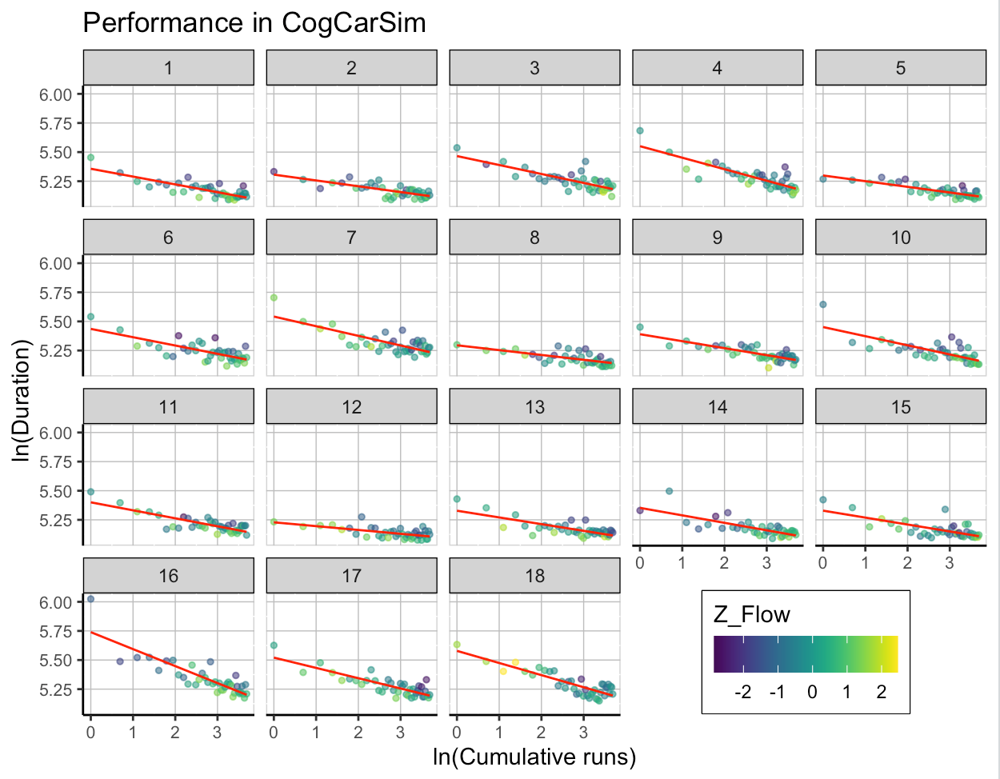

**IF YOU DON'T HAVE YOUR OWN DATA: As the final assignment for the course, you should use the "FSS learning" dataset to reproduce the figure below.**

{#id .class width=650}

### Background

The dataset (fss_learning.csv) was used briefly in week 4 exercises, and contains data from 18 participants in a simple steering game. Each participant completed 40 runs (variable `cumrun`) of the game, finishing a track as fast as they could, i.e. the shorter the run duration (variable `duration`), the better the performance. After each run, participants were asked to evaluate their performance using a ten-item Flow Short Scale, from which an aggregate *flow score* (variable `flow`) was calculated (range 1-7).  

This figure illustrates the relationship between flow and performance in a longitudinal design - the idea being that flow is higher when performance is *better than expected*, i.e. below the learning curve.  

### Instructions

Pay attention to the following things:  

* x-axis has cumulative runs, y-axis has run durations, both **log-transformed** with `ln()` (to make the relationship linear)   
* **participant-wise** linear regression curves   
* points colored by flow score
  * these should be **standardized by participant** before plotting!  
  * for each participant, the mean is 0 and SD is 1 (i.e. values are both centered and scaled)  
  * this is done to depict within-participant variation in flow scores  
  * you can use `group_by()` and `scale(center = T, scale = T)`, or manually subtract the mean and divide by SD (participant-wise)   
* facets based on participant ID  
* colors come from the viridis package - you don't need to use these exact colors, but make your plot clear (e.g. to distinguish clearly between low and high flow scores)  
* some tweaking with the theme, legend position, labels, etc. is required  
